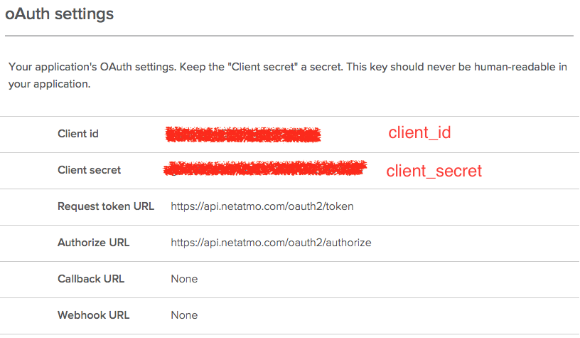

# LaMetric app for Netatmo Weather Station

A simple client which turns LaMetric into Netamo display. This client polls [Netatmo API](https://github.com/philippelt/netatmo-api-python)  and shows the weather data on LaMetric display.


## LaMetric Setup

Go to the [LaMetric Developper site](https://developer.lametric.com)

And create an app with user interface with following frames:

1. "Name" frame for Outdoor temperature value
2. "Sparkline" frame for Outdoor temperature graph
3. "Name" frame for Outdoor humidity value
4. "Name" frame for Pressure trend (icon) and value
5. "Name" frame for Sunrise time
6. "Name" frame for Sunset time

Note: Both frame text and icon are optional. They will be overriden by the script.

Make sure to set the app to use *Push Mode*. Publish your app as a private app.


Keep a copy of the: 
- App ID 
- Access Token

## Netatmo Setup

Go to the [Netatmo Developer Site](https://dev.netatmo.com)

Again create an app. Leave Redirect URI / Webhook URI empty. Make sure to enable the app. 



Keep a copy of the: 
- Client id
- Client secret
- Your netatmo app developer username (email) and password

## Update Script 

Once you have created your LaMetric and Netatmo apps you can use APIs to access the data. Now open the `updateLaMetric.py` script and copy in the credentials from the steps above:

```
# Netatmo authentication
client_id     = '...'
client_secret = '...'
username      = '...'
password      = '...'

# LaMetric authentication
access_token  = '...'
app_id        = '...'
```

Running `updateLaMetric.py` script should give you immediate feedback on how successful you are with the setup process. Once everything is OK the easiest way to keep the LaMetric display updated is via cron task:

```
*/10 * * * * /home/lametric/updateLaMetric.py
```

Enjoy!
